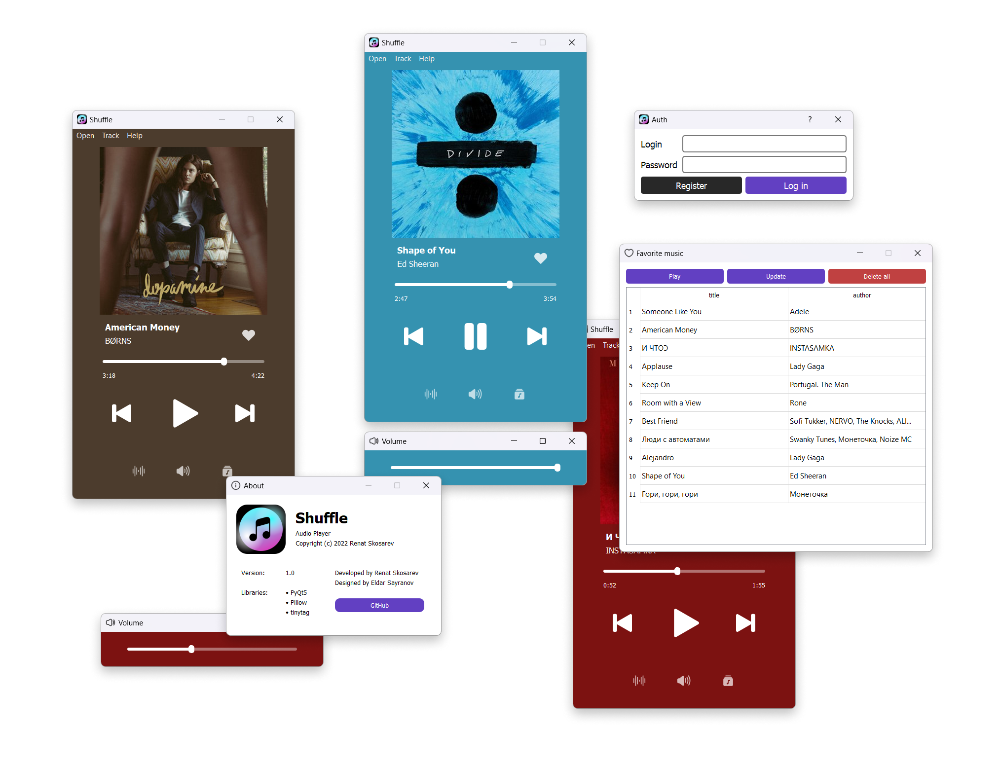

# Shuffle Audio Player



## Main features:

* Open audio, open folder
* Play and pause
* Add Audio to Favorites
* Change volume

## Installation:

1. Clone repository

```
git clone https://github.com/skosarex/AudioPlayer
```

2. Run program

```
py -m App
```

#

[Description](description.md) • [Screenshots](screenshots)