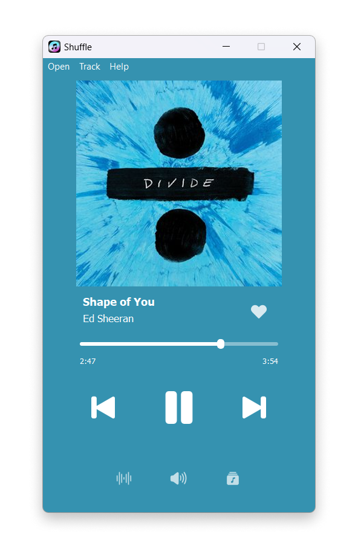
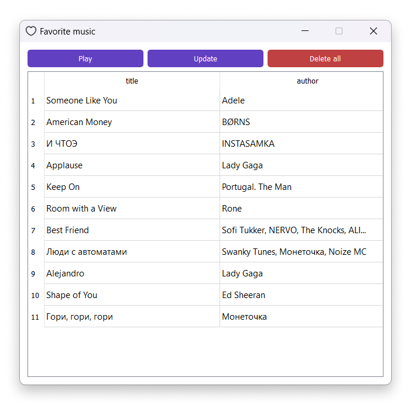
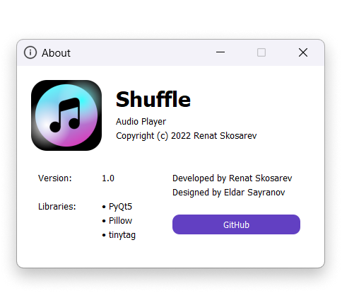

# Пояснительная записка

## Введение

Приложение создано для прослушивания аудиозаписей с диска устройства.
Оно поддерживает открытие одного аудиофайла или всех аудиофайлов из директории.
При разработке большое внимание было уделено интерфейсу и удобству использования приложения пользователем.
Планируется позднее добавить возможность наложения эффектов при воспроизведении (ускорение, замедление, реверс), выбор 
темы оформления интерфейса (светая/темная), создание своих тем интерфейса, выбор языка отображения текста.

## Описание работы компонентов программы

При запуске приложения появляется окно авторизации, предназначенное для ввода логина и пароля, вводимые данные 
валидируются. Основное окно программы содержит элементы управление воспроизведением (добавить и удалить из «избранного»,
воспроизвести и поставить на паузу, перейти к следующей/предыдущей аудиозаписи). Кнопки снизу окна отвечают за открытие
меню с регулировкой громкости и просмотром любимых песен.

* В верхнем меню основного окна располагаются кнопки для:
* Открытия файла
* Открытия всех файлов из директории
* Просмотра информации о проигрываемой песне
* Открытия меню «О программе»
* Связи с автором

## Таблицы БД

* Таблица audiofile: id (первичный ключ), user_id (внешний ключ), title, author, file_path. Связка user_id + file_path 
уникальна. 
* Таблица user: id (первичный ключ), name, login (уникален), password.

## Скриншоты

* Меню аутентификации

* Главное меню

* Меню регулировки громкости

* Меню с подробной информацией о песне

* Меню с любимыми песнями

* Меню «О Программе»

## Зависимости

* PyQt5
* Pillow
* tinytag